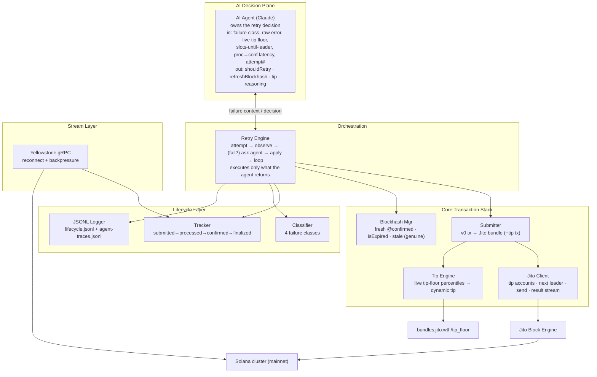
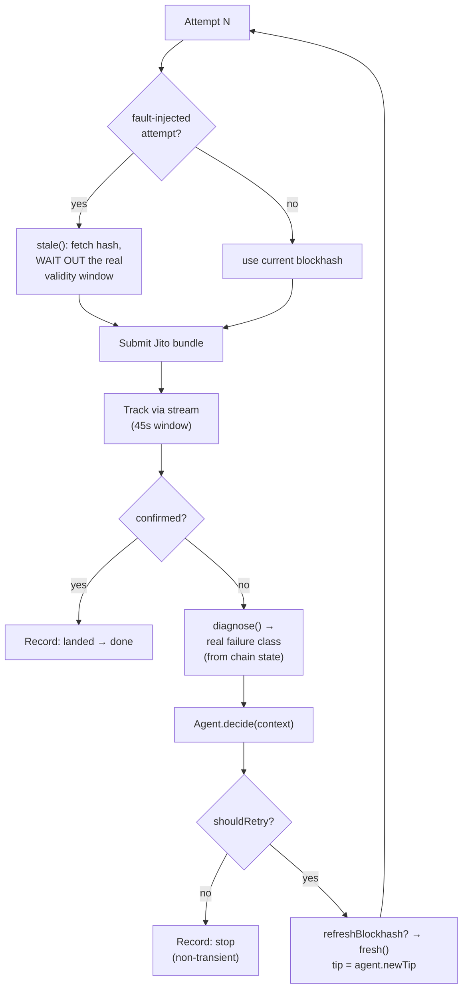

# Smart Transaction Stack — Architecture

> **This is the bounty's required architecture document.** It is written to be
> published to a public URL (Notion / Google Docs / Figma) **separate from the
> GitHub repository**, per the bounty rules — this file is the canonical source.
>
> **Diagrams** are provided twice: as inline ASCII (readable anywhere) and as
> [Mermaid](https://mermaid.live) source (renders natively in Notion and GitHub;
> paste into mermaid.live to export PNG/SVG for Figma or Google Docs).
>
> Author: GreYat Labs (`@GreYat_Labs`) · Bounty: *Advanced Infrastructure
> Challenge – Build a Smart Transaction Stack* (Superteam Nigeria).

---

## 0. Thesis

On Solana, "I sent a transaction" and "it landed" are different claims separated
by an entire hidden lifecycle: leader scheduling, TPU ingestion, block
production, shred propagation, and several commitment stages. Most tooling stops
at *send*. **This stack closes the loop** — it observes the network in real time,
prices its way into a block, tracks each transaction across every commitment
stage, classifies *why* things fail, and lets an AI agent own one real
operational decision: how to retry.

Two principles drive every design choice:

1. **Evidence over optimism.** Confirmation is derived from a live stream and
   cross-checkable on-chain slots — not from "the RPC returned 200". Failures are
   *observed*, never assumed.
2. **A hard wall between reasoning and effects.** The AI layer returns *data*
   (a decision). The deterministic core performs *effects* (submit, refresh,
   retry). The agent can be swapped or disabled without touching the transaction
   machinery — and the core never contains a hardcoded retry policy.

---

## 1. System architecture

The stack is four layers plus an AI decision plane, with a clean dependency
direction: the **Retry Engine** orchestrates the core; the **AI Agent** sits
above it and only ever exchanges `{failure context} → {decision}`; the **Stream**
and **Jito Block Engine** are the two external real-time surfaces.

```
                ┌───────────────────────────────────────────────┐
                │              AI AGENT  (Claude)               │
                │   owns ONE decision: the autonomous retry      │
                │                                               │
                │   in : failure class, raw error, live tip      │
                │        floor, slots-until-leader, recent       │
                │        processed→confirmed latency, attempt #  │
                │   out: { shouldRetry, refreshBlockhash,        │
                │          tipLamports, reasoning }              │
                └──────────────▲───────────────┬───────────────┘
                 failure context│               │ decision (data only)
                ┌───────────────┴───────────────▼───────────────┐
                │                RETRY ENGINE                    │
                │  attempt → observe outcome → (fail?) ask agent │
                │  → apply EXACTLY what it returned → loop/stop  │
                │  no hardcoded retry path lives here            │
                └───▲──────────────┬──────────────────┬─────────┘
          lifecycle │              │ submit            │ fault inject
        ┌───────────┴────────┐ ┌───▼──────────────┐ ┌─▼───────────────┐
        │  LIFECYCLE LAYER   │ │   CORE STACK     │ │  BLOCKHASH MGR   │
        │  • tracker         │ │  • Tip engine    │ │  fresh (confirmed)│
        │  • classifier      │ │  • Submitter     │ │  isExpired()     │
        │  • JSONL logger    │ │  • Jito client   │ │  stale() (real)  │
        └───────────▲────────┘ └───┬──────────────┘ └─────────────────┘
            slots / tx│             │ bundle (+ dynamic tip tx)
        ┌─────────────┴──────┐ ┌────▼─────────────────────────────────┐
        │  STREAM LAYER      │ │        JITO BLOCK ENGINE             │
        │  Yellowstone gRPC  │ │  tip accounts · next leader · send   │
        │  reconnect + back- │ │  bundle · bundle-result stream       │
        │  pressure          │ └──────────────────────────────────────┘
        │  (Dragon's Mouth)  │            ▲
        └─────────┬──────────┘            │ tip_floor percentiles
                  │ slot/tx stream        │
            ┌─────▼─────────────┐   ┌─────┴──────────────┐
            │  Solana cluster   │   │ bundles.jito.wtf    │
            │  (mainnet)        │   │ /tip_floor (live)   │
            └───────────────────┘   └────────────────────┘
```

<details><summary><b>Mermaid source — system architecture</b></summary>


</details>

---

## 2. Key components

| Component | File | Responsibility |
| --------- | ---- | -------------- |
| **Stream layer** | `src/stream/yellowstone.ts` | Yellowstone (Dragon's Mouth) gRPC. Subscribes to **slot-status** updates (`allSlots`) and **transactions touching our wallet** (`accountInclude`, `failed: true` — we *want* failures). **Reconnect** with exponential backoff (1s → 30s cap, re-sends the subscription) and **backpressure** (a bounded queue pauses the gRPC stream above the high-water mark and resumes at half). Emits typed `slot` / `transaction` / `connect` / `disconnect` / `error`. |
| **Tip engine** | `src/core/tip-engine.ts` | Fetches the **live Jito tip floor** (`bundles.jito.wtf/api/v1/bundles/tip_floor`) — recent landed-tip percentiles (p25…p99 + EMA), converted SOL→lamports. `computeTip` picks a base percentile by aggressiveness (`low`→p50, `medium`→p75, `high`→p95), blends `0.7·base + 0.3·EMA` to smooth single-sample spikes, and clamps to `[minTip=1000, maxTip]`. **No hardcoded tips.** |
| **Jito client** | `src/core/jito.ts` | Thin wrapper over `jito-ts` that unwraps its `Result` type: `getTipAccounts`, `getNextScheduledLeader` (leader-window detection), `sendBundle` (returns the bundle UUID), and `onBundleResult` (landing/failure stream). |
| **Submitter** | `src/core/submitter.ts` | Builds a v0 **self-transfer** payload tx (1 lamport to self — cheap, always valid, non-competitive, so landing depends on tip/timing not the tx's own merit), assembles a Jito **bundle** with a tip tx to a randomly-picked tip account, and submits. |
| **Blockhash mgr** | `src/core/blockhash.ts` | Fetches blockhashes at **`confirmed`** commitment (never `finalized`). `isExpired()` compares block height to `lastValidBlockHeight`. `stale()` produces a **genuinely expired** blockhash for fault injection (see §5). |
| **Lifecycle tracker** | `src/lifecycle/tracker.ts` | Advances `submitted → processed → confirmed → finalized` **from the stream**: a tx appearing in the stream marks `processed` + its landed slot; subsequent slot-status updates crossing that slot advance `confirmed`/`finalized`. RPC `getSignatureStatuses` runs only as a **backstop** (every 2s) so a missed stream frame can't strand a record. Captures slots + per-stage timestamps. |
| **Classifier** | `src/lifecycle/classifier.ts` | Maps thrown errors *and* Jito `BundleResult`s to one of four classes: `expired_blockhash`, `fee_too_low`, `compute_exceeded`, `bundle_failure` (or `unknown`/`none`). |
| **Logger** | `src/lifecycle/logger.ts` | Appends structured `LifecycleRecord`s (label, attempt, bundleId, signature, tip, slots, per-stage timestamps, latency deltas, failure class, fault-injected flag, agent decision) to `logs/lifecycle.jsonl` — the artifact judges cross-reference on an explorer. |
| **AI agent** | `src/agent/agent.ts` | Owns the retry decision via **Claude** (`@anthropic-ai/sdk`, `claude-opus-4-8`, adaptive thinking + structured output). Logs prompt+response to `logs/agent-traces.jsonl`. Falls back to a clearly-labelled deterministic heuristic only when no API key is set or the call errors. |
| **Retry engine** | `src/retry/engine.ts` | Orchestration. Runs the `attempt → outcome → (fail?) decide → apply` loop and **executes the agent's decision** — it contains no hardcoded retry policy of its own. |
| **Runner** | `src/cli/run-bundles.ts` | Phase-5 driver: performs N real bundle submissions (default 10), injects genuine blockhash expiry on runs #3 and #7, and writes the lifecycle + agent-trace logs. |

---

## 3. Data flow between services

The steady-state loop for a single bundle, end to end:

```
 ┌────────┐   tip_floor    ┌──────────┐
 │Tip eng.│◄───────────────│bundles.  │      1. OBSERVE
 └───┬────┘                │jito.wtf  │      Stream feeds slot-status + our-wallet
     │ tip (lamports)      └──────────┘      txs into the tracker; Jito supplies
     ▼                                       leader timing (getNextScheduledLeader).
 ┌────────┐  confirmed bh  ┌──────────┐
 │Submit- │◄───────────────│Blockhash │      2. SUBMIT
 │ ter    │                │ manager  │      Tip engine → tip. Blockhash mgr →
 └───┬────┘                └──────────┘      confirmed-commitment hash. Submitter
     │ bundle (+ tip tx)                     builds the bundle, sends to Jito,
     ▼                                       gets {bundleId, signature, submitSlot}.
 ┌────────────┐  UUID    ┌─────────────┐
 │Jito Block  │─────────►│ Solana      │      3. TRACK
 │ Engine     │  lands   │ cluster     │      Tracker watches the STREAM for our
 └────────────┘          └──────┬──────┘      signature → processed + landed slot,
                                │ slot/tx     then advances confirmed/finalized as
                         ┌──────▼──────┐       slot-status updates cross the landed
                         │ Yellowstone │       slot. RPC poll backstops missed frames.
                         │  gRPC       │
                         └──────┬──────┘       4. CLASSIFY
                                │ events       No confirmation in the window, or a
                         ┌──────▼──────┐       thrown/bundle error → one of four
                         │  Tracker +  │       failure classes (derived from real
                         │ classifier  │       on-chain state, never asserted).
                         └──────┬──────┘
                   failure?     │              5. DECIDE
                         ┌──────▼──────┐       On failure the engine hands the agent
                         │  AI Agent   │       the full context; the agent returns a
                         └──────┬──────┘       reasoned {retry?, refresh?, tip}.
                   decision     │
                         ┌──────▼──────┐       6. APPLY & LOOP
                         │Retry Engine │       Engine refreshes the blockhash and/or
                         └─────────────┘       re-prices the tip EXACTLY as instructed,
                                               then retries — or stops. Every step is
                                               appended to lifecycle.jsonl.
```

<details><summary><b>Mermaid source — submit→track→decide sequence</b></summary>

```mermaid
sequenceDiagram
    participant R as Retry Engine
    participant T as Tip Engine
    participant B as Blockhash Mgr
    participant S as Submitter→Jito
    participant Y as Yellowstone Stream
    participant L as Lifecycle Tracker
    participant A as AI Agent (Claude)

    R->>T: fetch live tip floor
    T-->>R: percentiles → computeTip()
    R->>B: fresh() @confirmed
    B-->>R: blockhash + lastValidBlockHeight
    R->>S: submit bundle (tx + tip tx)
    S-->>R: {bundleId, signature, submitSlot}
    R->>L: track(signature, timeout 45s)
    Y-->>L: tx seen → processed + landed slot
    Y-->>L: slot CONFIRMED ≥ landed → confirmed
    Y-->>L: slot FINALIZED ≥ landed → finalized
    alt confirmed in window
        L-->>R: landed → log record, done
    else no confirmation / error
        L-->>R: stages empty
        R->>R: diagnose() → failure class (from chain state)
        R->>A: decide(context)
        A-->>R: {shouldRetry, refreshBlockhash, tip, reasoning}
        R->>B: refresh() if instructed
        R->>R: tip = newTip; retry or stop
    end
```
</details>

**Inter-service contracts (the seams that matter):**

- **Stream → Tracker:** typed `SlotUpdate` / `TxUpdate` events. The tracker keys
  on the transaction *signature* and the *landed slot*; confirmation is a function
  of `maxConfirmedSlot ≥ landedSlot`, not of an RPC reply.
- **Tip floor → Tip engine:** percentile JSON in SOL, converted to lamports at
  the boundary; everything downstream is integer lamports.
- **Engine ↔ Agent:** a pure data contract (`RetryContext` in, `RetryDecision`
  out). No side effects cross this line in either direction.
- **Engine → Jito:** a bundle is `[payload tx, tip tx]`; the return is a UUID, and
  landing/failure arrives via the bundle-result stream or absence-of-confirmation.

---

## 4. Infrastructure decisions

| Decision | Why |
| -------- | --- |
| **Streaming over polling for confirmation** | Confirmation is driven by Yellowstone slot/tx streams; RPC `getSignatureStatuses` is a *backstop only*. Polling alone misses the sub-second, per-stage timing the lifecycle log is meant to capture, and cannot observe slot-status transitions (`processed`→`confirmed`→`finalized`) directly. The bounty explicitly requires more than RPC polling. |
| **`confirmed`, not `finalized`, for blockhashes** | A `finalized` blockhash is already ~31+ slots behind the chain tip the moment you fetch it, burning ~20% of the ~150-slot (~60s) validity window before you've even built the transaction (see README Q2). Fetching at `confirmed` starts you near the tip and maximizes the window in which the tx can land. |
| **Dynamic tips from the live floor** | Tips track *real recent* landed-tip percentiles, blended with the EMA to absorb single-sample spikes and clamped to a hard ceiling (`MAX_TIP_LAMPORTS`). No hardcoded tip values — the bounty disqualifies them, and a static tip is wrong the moment network conditions move. |
| **Leader-window awareness** | `getNextScheduledLeader` exposes `slotsUntilNextLeader`, which is fed to the agent so it can reason about *when* to submit/retry — a Jito bundle only executes if a Jito-Solana leader builds that slot. |
| **Mainnet for evidence** | Jito bundles do **not** run on devnet. Real lifecycle logs (with slots a judge can verify on an explorer) require mainnet (tiny tips on trivial self-transfers, ~0.3 SOL budget) or Jito testnet. Mainnet is the credible default. |
| **Claude for the AI layer, behind a thin seam** | The agent uses the official Anthropic SDK with adaptive thinking + structured outputs, so the decision comes back schema-validated rather than coaxed out of prose. It's isolated behind a `decide(context) → decision` interface, so the model is swappable and a deterministic fallback keeps the stack running with no key. |
| **Clean AI/stack separation** | The agent returns data; the engine performs effects. This makes the AI layer testable in isolation, the retry path auditable (every decision is logged with its reasoning), and the "is this just a wrapper?" disqualifier a non-issue — the engine has no retry policy of its own to fall back on. |
| **TypeScript** | Mature first-party libraries for every external surface — `@triton-one/yellowstone-grpc`, `jito-ts`, `@anthropic-ai/sdk`, `@solana/web3.js` — which is the fastest path to a *running* system that produces real evidence within the deadline. |

---

## 5. Failure-handling strategy

Failure handling is a first-class requirement, not an afterthought — happy-path-only
runs score poorly. The strategy is **detect → classify → reason → recover**, and
crucially, **the failures the log records are real**.

**Detection.** A bundle that never confirms within its window (tracker timeout,
45s) or a thrown/bundle error triggers the failure path. Detection is
stream-driven, with RPC as backstop.

**Classification (four required classes).** The classifier inspects the real
error text and Jito `BundleResult` and maps to:

- `expired_blockhash` — blockhash/blockheight exceeded
- `fee_too_low` — uncompetitive tip / auction loss
- `compute_exceeded` — CU budget exceeded
- `bundle_failure` — dropped/rejected bundle

**Genuine fault injection (the integrity-critical part).** To exercise the
agent's `detect → reason → refresh → re-tip → resubmit` path on a *real* failure,
the runner forces a blockhash expiry on runs #3 and #7. It does **not** fake the
error:

```
BlockhashManager.stale():
   1. fetch a real, currently-valid blockhash (records its real lastValidBlockHeight)
   2. poll getBlockHeight() every 2s until height > lastValidBlockHeight
      — i.e. WAIT OUT the genuine ~150-slot validity window (cap 180s)
   3. return the now-genuinely-expired hash

RetryEngine, on a fault-injected attempt:
   • submits with that hash → the bundle genuinely cannot land
   • DERIVES the failure class from on-chain state (diagnose()/classifyError),
     never asserts "expired_blockhash" by fiat
```

This matters because the bounty cross-references slot numbers on Solana
explorers. A faked expiry that still submitted a *valid* hash could actually land
on-chain while the log claimed a failure — a contradiction a judge would catch.
By genuinely exhausting the window, the failure is real and leaves no
contradictory transaction.

<details><summary><b>Mermaid source — autonomous retry with genuine fault injection</b></summary>


</details>

**Recovery.** Bounded retries (2 normal / 3 for fault runs). The *levers* —
whether to retry, whether to refresh the blockhash, what tip to use — are chosen
by the agent, not hardcoded. The engine clamps the agent's tip into
`[minTip, maxTip]` as a safety rail.

**Stream resilience.** Reconnect with exponential backoff (1s→30s) re-sends the
subscription on drop; backpressure pauses the gRPC stream when the consumer lags
and resumes at half the high-water mark — so a slow consumer or a dropped
connection never corrupts lifecycle tracking.

---

## 6. AI agent responsibilities

The agent owns **exactly one real operational decision: the retry** — the
*"Autonomous Retry with Fault Injection"* option from the bounty. It is given the
full failure context and returns a reasoned decision; the engine executes it.

**Inputs (`RetryContext`):** failure class, raw error string, last tip, the live
tip-floor percentiles, min/max tip bounds, `slotsUntilNextLeader`, the most recent
*real* `processed→confirmed` latency (a network-health signal), and the attempt
number.

**Outputs (`RetryDecision`, schema-validated):**

| Field | Meaning |
| ----- | ------- |
| `shouldRetry` | Whether retrying can plausibly succeed (false if non-transient or attempts exhausted). |
| `refreshBlockhash` | Whether to refetch the blockhash before retrying. |
| `tipLamports` | The retry tip, chosen from live floor data + conditions, within bounds. |
| `reasoning` | 1–3 sentences explaining *why*, referencing the specific failure and signals. |

```
            RetryContext                         RetryDecision
   ┌──────────────────────────┐         ┌────────────────────────────┐
   │ failure class            │         │ shouldRetry  : bool         │
   │ raw error                │  Claude │ refreshBlockhash : bool     │
   │ live tip floor (p25..p99)│────────►│ tipLamports : int (clamped) │
   │ slotsUntilNextLeader     │ adaptive│ reasoning   : 1-3 sentences │
   │ recent proc→conf latency │ thinking└────────────────────────────┘
   │ attempt # / maxAttempts  │   +
   └──────────────────────────┘ structured     (logged verbatim to
                                  output         agent-traces.jsonl)
```

**Why this is reasoning, not sequential automation.** The engine contains **no
hardcoded retry policy**. It calls `agent.decide()` and applies whatever comes
back — refresh or not, this tip not that one, retry or stop. The full prompt and
the model's response (including its reasoning) are logged to
`logs/agent-traces.jsonl`, so the decision is auditable rather than a black box.
A deterministic heuristic exists *only* as an explicitly-labelled fallback
(`source: "fallback"`) for when no API key is configured — and it is visibly
distinguished from real agent decisions (`source: "agent"`) in every log record.

**Representative reasoned outcomes:**

- **expired_blockhash** → *"Blockhash exhausted its validity window; a refresh is
  mandatory. The tip was not the cause, so hold near p50 to avoid overspending."*
  → `{shouldRetry: true, refreshBlockhash: true, tip ≈ p50}`
- **fee_too_low / auction loss** → *"Bundle lost the auction; the tip was
  uncompetitive. Raise toward p95 but stay under the ceiling; the blockhash is
  still valid, so no refresh."* → `{shouldRetry: true, refreshBlockhash: false,
  tip ≈ p95}`
- **compute_exceeded** → *"Deterministic failure; retrying unchanged cannot help.
  Stop."* → `{shouldRetry: false}`

---

## 7. What the run produces (evidence)

| Artifact | Contents |
| -------- | -------- |
| `logs/lifecycle.jsonl` | One record per attempt: slots, per-stage timestamps, latency deltas, tip, failure class, fault-injected flag, and the agent decision. ≥10 real bundles, ≥2 genuine failures. Judges cross-reference the slot numbers on a Solana explorer. |
| `logs/agent-traces.jsonl` | The verbatim prompt + Claude response for every retry decision — the visible reasoning. |
| `README` | Answers the three required questions from real observations in the logs (processed→confirmed delta as a health signal; why not `finalized` for a time-sensitive blockhash; what happens when the Jito leader skips its slot). |

---

## Appendix — repository layout

```
src/
  config.ts                 # env + wallet loader (Anthropic by default)
  types.ts                  # LifecycleRecord, RetryDecision, TipFloor, …
  stream/yellowstone.ts     # gRPC stream: reconnect + backpressure
  core/
    tip-engine.ts           # live tip-floor → dynamic tip (no hardcoding)
    blockhash.ts            # confirmed-commitment hashes; genuine stale()
    jito.ts                 # jito-ts wrapper: tip accts, leader, send, results
    submitter.ts            # v0 tx → Jito bundle
  lifecycle/
    tracker.ts              # stream-driven commitment-stage tracking
    classifier.ts           # 4 failure classes
    logger.ts               # JSONL lifecycle log
  retry/engine.ts           # orchestration; executes the agent's decision
  agent/agent.ts            # Claude-owned retry decision + fallback
  cli/
    hello-stream.ts         # Phase-0 stream smoke test
    run-bundles.ts          # Phase-5 runner: N bundles + fault injection
```

> **Publishing checklist:** paste this document into Notion/Google Docs/Figma,
> render the Mermaid blocks (or export them as images), and put the public URL in
> the Superteam submission. Keep this file in the repo as the source of truth.
